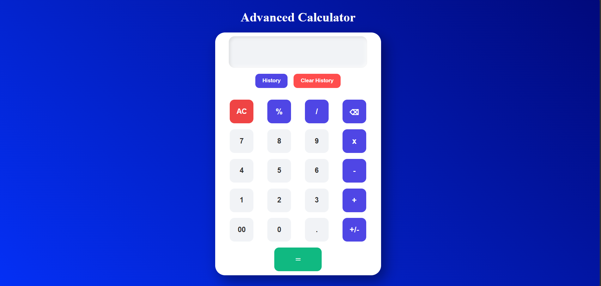

# Advanced Calculator

A modern and responsive calculator built using HTML, CSS, and JavaScript. This project performs basic arithmetic operations while providing an enhanced user experience with keyboard support, calculation history, and persistent data storage.

## Features

* Addition, Subtraction, Multiplication, and Division
* Decimal Number Support
* Percentage Calculation
* Positive/Negative Toggle
* Backspace Functionality
* All Clear (AC) Button
* Keyboard Support
* Calculation History
* Persistent History using Local Storage
* Show/Hide History Panel
* Clear History Option
* Input Validation for Invalid Expressions
* Responsive Design for Mobile and Desktop Devices
* Modern User Interface with Hover Effects

## Technologies Used

* HTML5 ✅
* CSS3 ✅
* JavaScript (ES6) ✅

## How to Run

1. Download or clone the repository.
2. Open `index.html` in any modern web browser.
3. Start performing calculations.

## Project Outcome

This project demonstrates DOM manipulation, event handling, local storage implementation, responsive web design, and JavaScript-based calculator logic in a user-friendly interface.

## Preview 

## Github Repository
https://github.com/gauri9368gupta-maker/CodeAlpha-Project

## Live Demo
https://gauri9368gupta-maker.github.io/CodeAlpha-Project/Task1-Frontend%20Calculator/
