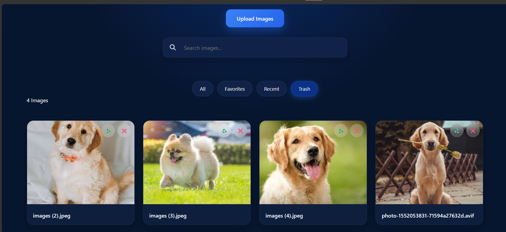
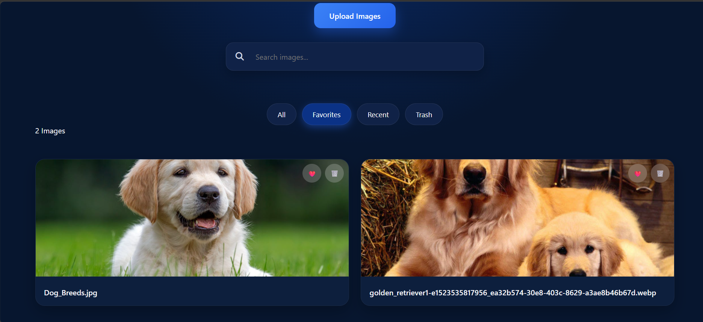

# Image Gallery

A modern and responsive Image Gallery built using HTML, CSS, and JavaScript. This project allows users to upload, organize, search, preview, and manage images with a clean and interactive user interface. Images are stored locally using Local Storage, ensuring data persists even after refreshing or reopening the browser.

## Features

* Upload Multiple Images
* Search Images by Name
* Favorite Images System
* Recent Images View
* Trash Management System
* Restore Deleted Images
* Permanent Delete Option
* Gallery Image Counter
* Empty State Display
* Fullscreen Lightbox Preview
* Next / Previous Image Navigation
* Local Storage Persistence
* Responsive Design for Mobile and Desktop Devices
* Smooth Hover Effects and Modern UI
* Keyboard Navigation Support

  * ESC to Close Preview
  * Left Arrow for Previous Image
  * Right Arrow for Next Image
* Click Outside to Close Preview

## Technologies Used

* HTML5 ✅
* CSS3 ✅
* JavaScript (ES6) ✅
* Local Storage API ✅

## How to Run

1. Download or clone the repository.
2. Open `index.html` in any modern web browser.
3. Click **Upload Images** to add images.
4. Manage images using Favorites, Recent, and Trash filters.
5. Click any image to open the fullscreen preview.

## Project Outcome

This project demonstrates practical implementation of:

* DOM Manipulation
* Event Handling
* File Upload Handling
* Local Storage Management
* Dynamic Rendering
* Search and Filtering Logic
* Responsive Web Design
* CRUD Operations (Create, Read, Update, Delete)
* Interactive User Experience Design

The project provides a real-world image management system while strengthening core frontend development concepts using vanilla JavaScript.

## Preview

## Github Repo Link🔗
https://github.com/gauri9368gupta-maker/CodeAlpha-project

## Live Link🔗
https://gauri9368gupta-maker.github.io/CodeAlpha-Project/Task2-Image%Gallery/

